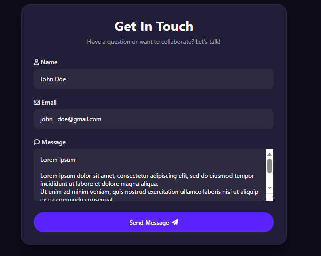
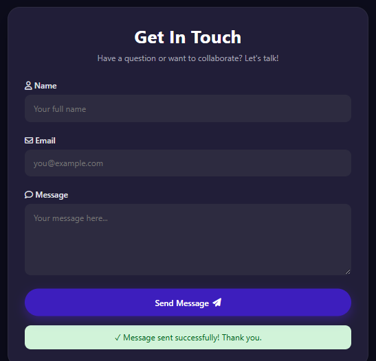
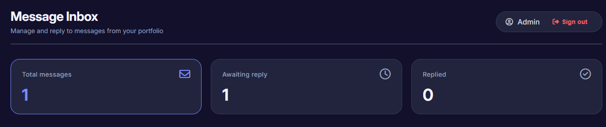
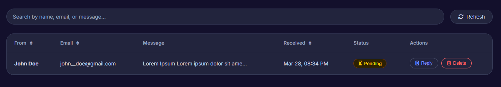

# Personal Portfolio Website

A modern responsive personal portfolio website showcasing my skills, projects, and services.  
It includes a fully functional contact system powered by Google Apps Script and Google Sheets, along with an admin dashboard for message management.

---

## Live Demo
https://my-portfolio1-weld.vercel.app/

---

## Screenshots

### Home Page

### Contact Form

### Message Sent Confirmation

### Admin - Messages View

### Admin - Reply System

---

## Features

- Modern responsive UI design
- About, Skills, Services, and Projects sections
- Interactive frontend design
- Functional contact form
- Real-time message handling via Google Apps Script
- Messages stored in Google Sheets
- Email notifications for new contact submissions
- Admin dashboard to view and manage messages
- Reply functionality in admin panel

---

## Contact System (How It Works)

The contact system is powered without a traditional backend:

1. User submits a message through the contact form
2. JavaScript sends data to Google Apps Script
3. Apps Script stores data in Google Sheets
4. Email notification is sent automatically
5. Admin dashboard displays all submitted messages
6. Admin can reply directly from dashboard

---

## Tech Stack

- HTML5
- CSS3
- JavaScript (Vanilla)
- Google Apps Script
- Google Sheets
- Email Integration (Apps Script)

---

## Admin Dashboard

The admin dashboard allows:
- Viewing all submitted contact messages
- Replying to messages
- Tracking user inquiries
- Managing communication efficiently

---

## Author

Built by David Kimathi (itsybitsyspyda)

---

## License

This project is for personal portfolio and learning purposes.
